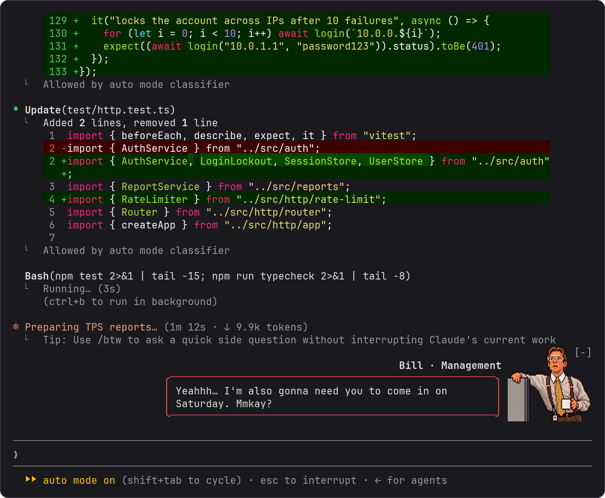

# tps-report

Bill from management drops by while Claude works.




A Claude Code mod. While Claude works, Bill pops up above the prompt at random moments with a line about TPS reports, cover sheets, or coming in on Saturday, then wanders off. Every so often, the spinner switches to "Preparing TPS reports…".

Bill is just for show. He never touches your prompts, Claude's tool calls, or anything Claude reads.

## Install

In Claude Code:

```
/plugin marketplace add vgnshiyer/mods
/plugin install tps-report@vgnshiyer-mods
```

[vgnshiyer/mods](https://github.com/vgnshiyer/mods) lists my other mods too.

Or load a clone for one session:

```bash
claude --plugin-dir ./tps-report
```

In Ghostty, kitty, and the Code tab of the Claude desktop app, Bill shows up as a real picture. Other terminals get a smaller pixel version of him.

## Config

Set these in `/config`:

| Option | Default | What it does |
| :- | :- | :- |
| `name` | `Bill` | Rename him after your own manager |
| `pingEverySeconds` | `90` | About how often he drops by while Claude works. Each gap is random, from half to one and a half times this. The minimum is 10. |

## Add a line

Bill's lines are in `hooks/lines.js`. PRs with your own boss's catchphrases are welcome. His picture is `art/bill.png`; after changing it, run `python3 art/build.py` to rebuild the frames.

---

Tested on Claude Code 2.1.287 and the desktop app's Claude Code 2.1.286.

A parody, not affiliated with or endorsed by the makers of *Office Space*.
